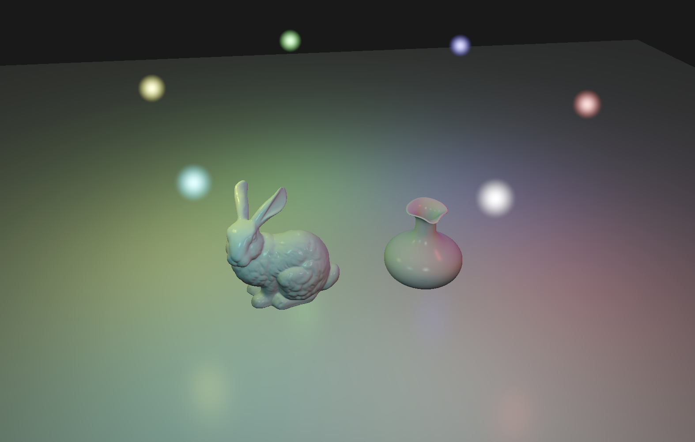

# A Vulkan Rasterizer

This C++ project is to build a modern rasterization pipeline around the Vulkan graphics API.




## About

Get familiar with modern Vulkan Graphics API.
Use Vulkan to build a rasterization pipeline on Apple Silicon M1/2 chip.
Rasterizer incudes: projective camera, shader loading and parsing, Vulkan pipeline components: Device, Swap Chain, Command Buffer, Descriptor, Push Constant, loading obj models, multi-point Lighting, alpha blending and more.

## Requirements

C++ Lib:
* GLM
* GLFW

Vulkan SDK:
* https://vulkan.lunarg.com/sdk/home

## Build on MacOS

C++17 is needed to compile the project.
```
./macBuild
```
## Run on MacOS
```
cd build
./Vulkan-Rasterizer
```
